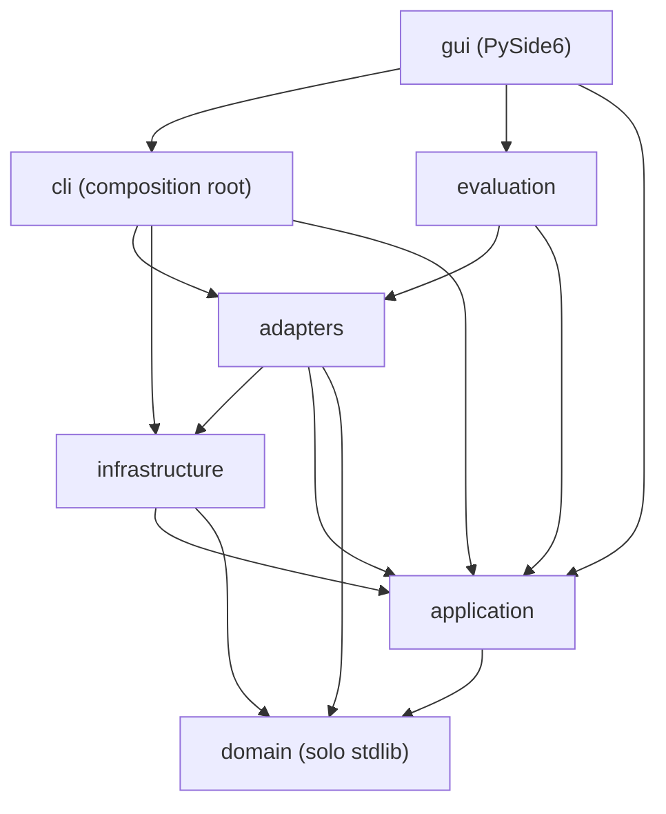
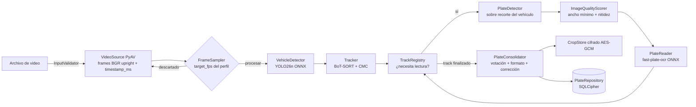

# ARQUITECTURA — lectorPlacas

> Archivo rector. Junto con `reglas-seguridad.md` y `CONTEXT.md` es fuente de verdad del proyecto.
> Ninguna spec puede contradecirlo. Si cambia, se revisa el impacto en los otros dos y en `specs/`.
> Requisitos de origen: `docs/00-requisitos.md` (aprobado 2026-09-24).

## 1. Visión general

Sistema ALPR local en Python 3.13. Procesa un archivo de video (cualquier resolución, fps variable,
rotación, cámara fija o en movimiento), detecta vehículos, los sigue (tracking), detecta y lee sus
placas, consolida las lecturas de cada track y persiste un **avistamiento** por track en una base
SQLCipher cifrada, con el recorte de la placa cifrado en disco. Precisión primero: lo dudoso queda
`unverified` para la revisión humana (CLI o GUI de escritorio, ADR-015).

**Decisión transversal:** la inferencia en runtime usa **ONNX Runtime** (no PyTorch). PyTorch y
Ultralytics viven solo en entornos de entrenamiento separados (`training/`). Ver ADR-009 y ADR-011.

## 2. Capas y regla de dependencia (Clean Architecture)

| Capa | Paquete | Contiene | Puede importar |
|---|---|---|---|
| Dominio | `lector_placas.domain` | Entidades, reglas de placas colombianas, corrección posicional, votación, excepciones | **Solo la biblioteca estándar** |
| Aplicación | `lector_placas.application` | Puertos (Protocols), casos de uso, muestreo de frames, registro de tracks | `domain`, `numpy` (solo como tipo de imagen), stdlib |
| Infraestructura | `lector_placas.infrastructure` | Configuración, rutas seguras, cripto, logging, registro de modelos, guardia de red, reloj | `domain`, `application`, librerías de terceros |
| Adaptadores | `lector_placas.adapters` | Implementaciones concretas de los puertos (PyAV, ONNX, trackers, fast-plate-ocr, SQLCipher, keyring, OpenCV) | `domain`, `application`, `infrastructure`, terceros |
| Entrada (composición) | `lector_placas.cli` | Composition root y comandos de la CLI | Todo, excepto `gui` |
| Entrada (GUI) | `lector_placas.gui` | Segundo composition root: GUI de escritorio PySide6 (ADR-015) | Todo, excepto `cli`; de `cli` solo `lector_placas.cli.composition` |
| Evaluación | `lector_placas.evaluation` | Métricas contra ground truth | `domain`, `application`, `infrastructure`, `adapters` |
| Datasets | `lector_placas.datasets` | Preparación de datos de entrenamiento (offline) | `domain`, `application`, `infrastructure`, `adapters` |

Reglas obligatorias:
1. `domain` no importa nada fuera de la stdlib (ni numpy, ni pydantic, ni cv2).
2. `application` no importa `adapters`, `infrastructure` ni `cli`; depende de abstracciones (DIP).
3. Nadie importa `lector_placas.cli`, salvo `gui`, que puede importar solo `lector_placas.cli.composition` (constructores
   de adaptadores, para no duplicar la composición). Nadie importa `lector_placas.gui`.
4. Los casos de uso reciben sus dependencias por constructor (inyección manual en `cli/composition.py`).
   No hay contenedores de DI, singletons ni variables globales mutables. `gui` compone igual, llamando a
   `composition.<función>`.
6. PySide6 solo se importa en `lector_placas.gui`. Ninguna capa interior conoce Qt.
5. La regla se verifica con `tests/architecture/test_dependency_rule.py` (spec 000).



## 3. Flujo del pipeline (`ProcessVideo`)



Pasos por frame muestreado:
1. `VehicleDetector.detect(frame.image)` → `list[VehicleDetection]` (car, motorcycle, bus, truck).
2. `Tracker.update(detections, frame.image, frame.timestamp_ms)` → `list[TrackedVehicle]` (solo IDs ≥ 0).
3. `TrackRegistry.observe(...)` actualiza primera/última aparición y votos de tipo de vehículo.
4. Para los tracks que aún necesitan lecturas (máx. `max_ocr_per_frame`, los de mayor área primero):
   recorte del vehículo con margen → `PlateDetector.detect` → mejor placa → filtros de calidad →
   `PlateReader.read` en lote → `PlateReading` al registro.
5. Tracks sin observaciones durante `track_finalize_after_ms` se finalizan: consolidación → recorte
   cifrado → `save_sighting`. Al terminar el video se finalizan todos.
6. Tracks sin ninguna lectura no se persisten (solo se cuentan en `RunStats`).

## 4. Puertos y adaptadores

Las firmas exactas están en `docs/02-contratos.md` (y copiadas en `CONTEXT.md`).

| Puerto (application/ports.py) | Responsabilidad | Adaptador v1 | Spec |
|---|---|---|---|
| `VideoSourceFactory` / `VideoSource` | Abrir video, entregar frames BGR upright con timestamp | `PyAVVideoSourceFactory` | 010 |
| `FrameSampler` | Decidir qué frames se procesan (por timestamp, VFR) | `TimeBasedFrameSampler` (application) | 009 |
| `VehicleDetector` | Detectar vehículos en un frame | `YoloVehicleDetector` (ONNX) | 013 |
| `PlateDetector` | Detectar placas en un recorte de vehículo | `OimPlateDetector` (open-image-models) / `YoloPlateDetector` (ONNX fine-tuned) | 014 / 015 |
| `Tracker` | Asignar IDs persistentes con compensación de cámara | `BotSortTracker` (trackers 2.6.0) | 016 |
| `PlateReader` | OCR de recortes de placa | `FastPlateOcrReader` | 017 |
| `ImageQualityScorer` | Nitidez de un recorte | `LaplacianQualityScorer` (OpenCV) | 018 |
| `PlateConsolidator` | Votación + formato + corrección → `ConsolidatedPlate` | `VotingPlateConsolidator` (domain) | 004 |
| `PlateRepository` | Persistencia de corridas y avistamientos | `SqlCipherPlateRepository` | 020 |
| `CropStore` | Guardar/leer/borrar recortes cifrados | `EncryptedFileCropStore` | 021 |
| `ExportStore` | Escribir CSV de avistamientos y borrar exportaciones vencidas | `CsvExportStore` | 026 |
| `KeyProvider` | Entregar la clave maestra de 32 bytes | `KeyringKeyProvider` | 008 |
| `ModelRegistry` | Ruta local verificada (SHA-256) de un modelo | `ManifestModelRegistry` (infrastructure) | 019 |
| `ReviewUI` | Mostrar recorte y pedir decisión al operador | `OpenCvReviewUI` (CLI); la GUI revisa desde la galería con `DecideSighting` | 027 / 046, 048 |
| `ProgressReporter` | Recibir el avance de `ProcessVideo` y pedir su cancelación | `QtProgressReporter` (GUI) | 040 / 043 |
| `SightingBrowser` | Buscar avistamientos con filtros, contarlos y listar corridas | `SqlCipherSightingBrowser` | 041 |
| `Clock` | Hora UTC actual | `SystemClock` (infrastructure) | 005 |

El orquestador (`ProcessVideo`) y los demás casos de uso dependen solo de estos Protocols.

## 5. Estructura de carpetas

```
lectorPlacas/
├── ARQUITECTURA.md  reglas-seguridad.md  README.md  LICENSE (AGPL-3.0)   (CONTEXT.md: local, no se publica)
├── pyproject.toml  uv.lock  .python-version  .pre-commit-config.yaml  .gitignore
├── config/
│   ├── lector.yaml          # configuración (perfiles, umbrales, catálogo de formatos)
│   └── models.yaml          # manifiesto de modelos: id, archivo, URL, SHA-256, licencia
├── src/lector_placas/
│   ├── domain/              # entities, errors, plate_formats, ocr_correction, consolidation, privacy
│   ├── application/         # ports, frame_sampler, image_ops, track_registry, process_video,
│   │                        # review_sightings, purge_expired, export_sightings
│   ├── infrastructure/      # config, paths, input_validation, crypto, logging_setup,
│   │                        # model_registry, model_fetcher, network_guard, clock
│   ├── adapters/
│   │   ├── video/           # pyav_source
│   │   ├── inference/       # onnx_session, letterbox, yolo_end2end, vehicle/plate detectors, plate_reader
│   │   ├── tracking/        # botsort_tracker
│   │   ├── imaging/         # quality (nitidez)
│   │   ├── persistence/     # schema.sql, sqlcipher_repository
│   │   ├── storage/         # encrypted_crop_store
│   │   ├── security/        # keyring_key_provider
│   │   ├── review/          # opencv_review_ui
│   │   └── export/          # csv_export_store
│   ├── evaluation/          # ground_truth, metrics, cer, vram_monitor, report
│   ├── datasets/            # dhash, yolo_format, sources, merge_detection, chars_to_ocr
│   ├── cli/                 # main (argparse), composition
│   └── gui/                 # app (arranque), main_window, páginas Procesar y Lecturas, tarjetas, worker
├── tests/
│   ├── architecture/        # regla de dependencia
│   ├── unit/                # espejo de src/, fixtures sintéticos
│   ├── integration/         # SQLCipher real, PyAV con video sintético, ONNX sintético
│   └── fixtures/            # generadores sintéticos (NUNCA datos reales)
├── training/
│   ├── detector/            # proyecto uv separado (paquete detector_training): torch cu130 + ultralytics — export y fine-tuning (spec 030)
│   └── ocr/                 # proyecto uv separado (paquete ocr_training): fast-plate-ocr[train] — fine-tuning OCR y sintéticos (specs 032–033)
├── docs/                    # requisitos, contratos, modelo de datos, evaluación, adr/
├── specs/                   # specs de implementación NNN-*.md + README.md
├── data/    (gitignored)    # lector.db, crops/, exports/, eval/
├── models/  (gitignored)    # pesos ONNX descargados o exportados
├── logs/    (gitignored)
└── videos/  (gitignored)    # directorio de entrada permitido por defecto
```

## 6. Convenciones de código (obligatorias)

**Nombres**
- Identificadores en inglés; docstrings, mensajes de error y logs en español.
- Módulos y funciones `snake_case`; clases `PascalCase`; constantes `UPPER_SNAKE_CASE`.
- Nombres que revelan intención: nada de `data`, `tmp`, `obj`, `x2` salvo coordenadas.
- Puertos terminan en su rol (`VehicleDetector`); adaptadores llevan la tecnología como prefijo
  (`YoloVehicleDetector`, `SqlCipherPlateRepository`).

**Tamaño**
- Funciones y métodos: **≤ 20 sentencias** (ruff `PLR0915` max-statements = 20), ≤ 6 argumentos
  (`PLR0913`), complejidad ciclomática ≤ 8 (`C901`), ≤ 8 ramas (`PLR0912`).
- Clases: ≤ 150 líneas y una sola responsabilidad. Módulos: ≤ 300 líneas, excepto los módulos de definición de
  contratos o configuración cuyo contenido fija una spec (`domain/entities.py`, `application/ports.py`,
  `infrastructure/config.py`).

**Tipos**
- Type hints obligatorios en toda firma y atributo; `mypy --strict` sin errores.
- `from __future__ import annotations` en todos los módulos.
- Entidades: `@dataclass(frozen=True, slots=True)` validadas en `__post_init__`.
- Colecciones inmutables en entidades (`tuple`, `frozenset`). Nada de `Any` salvo en el borde con
  librerías sin tipos, encapsulado en el adaptador y con `# type: ignore[<código>]` explícito.

**Docstrings**
- Estilo Google en todo módulo, clase y función pública. Los puertos documentan
  **Precondiciones**, **Postcondiciones** y **Raises**.

**Errores**
- Solo excepciones propias que heredan de `LectorPlacasError` (`domain/errors.py`).
- Prohibido `raise Exception`, `except Exception:` y `except:` desnudos, salvo en `cli/main.py`
  (último nivel, que registra y devuelve código de salida 1) y, en la GUI, en `gui/app.py` (arranque y
  `sys.excepthook`) y en el método que ejecuta el trabajo del hilo de procesamiento (`gui/processing.py`): un hilo que
  muere en silencio dejaría la ventana esperando. En esos puntos se registra con `logger.exception` y se muestra al
  operador un mensaje genérico.
- Los adaptadores capturan excepciones específicas de la librería y las envuelven con `raise ... from e`.
- No se usan excepciones para control de flujo normal; no se retorna `None` para señalar error.

**Logging**
- `logging.getLogger(__name__)` por módulo; nunca `print` fuera de `cli/`.
- Formato `clave=valor`. **Nunca** texto de placa en claro: usar `mask_plate()` (spec 022). Un filtro
  de logging enmascara además cualquier patrón de placa como defensa en profundidad.
- Niveles: `DEBUG` detalle por frame, `INFO` hitos de corrida, `WARNING` degradaciones,
  `ERROR` fallos de una corrida.

**Otros**
- Sin estado global mutable. Sin `print`. Sin `assert` en código de producción.
- Rutas con `pathlib.Path`. Tiempo en UTC con `datetime.now(UTC)` solo a través del puerto `Clock`.
- Imports absolutos (`from lector_placas.domain.entities import ...`).
- Tests: pytest, nombres `test_<unidad>_<comportamiento>`, fixtures **sintéticos**, sin red.

## 7. GUI de escritorio (ADR-015)

- Arranque (`gui/app.py`): `os.umask(0o077)` primero, configuración, logging, clave maestra del keyring, `block_network()`,
  y solo después la `QApplication`. Al abrir la sesión se purga por retención (SEG-03), como en cada comando de la CLI.
- Hilos: el hilo de la GUI tiene su propio `SqlCipherPlateRepository` (lecturas, revisión, exportación, purga).
  `ProcessVideo` corre en un `QThread` que construye **su propia** conexión a la BD, su almacén de recortes y los modelos
  (una conexión SQLite no se comparte entre hilos). Mientras procesa, la GUI deshabilita las acciones que escriben
  (revisión, exportación, purga); solo lee.
- La revisión se hace en la página "Lecturas" (galería de tarjetas con recorte y lectura, spec 048): cada decisión
  sobre una tarjeta usa `DecideSighting` (spec 046), con las mismas reglas y la misma auditoría que `ReviewSightings`.
- cv2 se usa solo para procesar imagen; la GUI no llama `cv2.imshow` ni `cv2.namedWindow` (el Qt5 de OpenCV y el Qt6
  de PySide6 conviven, pero sus ventanas no deben mezclarse).

## 8. Configuración y perfiles

Un único archivo `config/lector.yaml` validado con pydantic (spec 006). Tres perfiles de escenario
(`parqueadero`, `calle_lenta`, `calle_rapida`) ajustan muestreo, filtros, finalización de tracks y
umbrales de consolidación. Valores iniciales **provisionales**; se calibran con `docs/04-evaluacion.md`.

## 9. Índice de ADRs

| ADR | Título | Resumen |
|---|---|---|
| [001](docs/adr/ADR-001-detector-vehiculos.md) | Detector de vehículos | YOLO26n preentrenado COCO exportado a ONNX (clases 2,3,5,7). |
| [002](docs/adr/ADR-002-detector-placas.md) | Detector de placas | Baseline `open-image-models` yolo-v9-t-384 (MIT, ONNX); luego YOLO26n fine-tuneado. |
| [003](docs/adr/ADR-003-ocr.md) | OCR | fast-plate-ocr `cct-xs-v2-global` + fine-tuning colombiano; PaddleOCR y VLM fuera de v1. |
| [004](docs/adr/ADR-004-tracker.md) | Tracker | BoT-SORT de `trackers` 2.6.0 (Apache-2.0) con CMC y timestamps. |
| [005](docs/adr/ADR-005-persistencia-cifrado.md) | Persistencia y cifrado | SQLCipher (`sqlcipher3`) + recortes AES-GCM; clave maestra en keyring, subclaves HKDF. |
| [006](docs/adr/ADR-006-muestreo-perfiles.md) | Muestreo y perfiles | Muestreo por timestamp a `target_fps` por perfil; lectura dirigida por track. |
| [007](docs/adr/ADR-007-votacion.md) | Votación y consolidación | Voto ponderado por carácter por patrón candidato, corrección posicional, reglas precisión-primero. |
| [008](docs/adr/ADR-008-licencia-agpl.md) | Licencia AGPL-3.0 | Repo público bajo AGPL-3.0 por usar Ultralytics. |
| [009](docs/adr/ADR-009-runtime-onnx.md) | Runtime de inferencia | ONNX Runtime GPU 1.30 (CUDA 13) en runtime; sin `torch.load`. |
| [010](docs/adr/ADR-010-decodificacion-pyav.md) | Decodificación | PyAV 18.1: timestamps por PTS (VFR) y rotación por display matrix. |
| [011](docs/adr/ADR-011-entorno-python.md) | Entorno | Python 3.13 + uv; PyTorch 2.14 cu130 solo en `training/`; proyectos uv separados. |
| [012](docs/adr/ADR-012-modelos-sin-red.md) | Modelos y red | Sin red en runtime; `models fetch` explícito; SHA-256 fijado en `config/models.yaml`. |
| [013](docs/adr/ADR-013-placa-en-vehiculo.md) | Placa dentro del vehículo | La placa se detecta en el recorte del vehículo, lo que asocia placa↔track sin heurísticas. |
| [014](docs/adr/ADR-014-receta-entrenamiento-ocr.md) | Receta del fine-tuning del OCR | Partición real por componente en train/val/test, sintéticos ≤ 50 % solo en train con cuota de motos, aceptación en test real contra el modelo base. |
| [015](docs/adr/ADR-015-interfaz-grafica.md) | Interfaz gráfica | GUI de escritorio PySide6-Essentials en el mismo proceso, sin sockets; convivencia con el Qt5 de `opencv-python` probada; la GUI no abre ventanas de cv2. |
