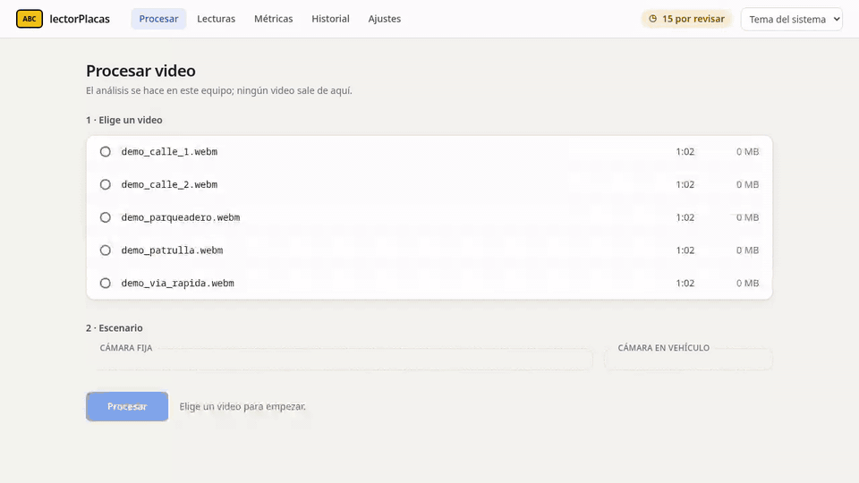
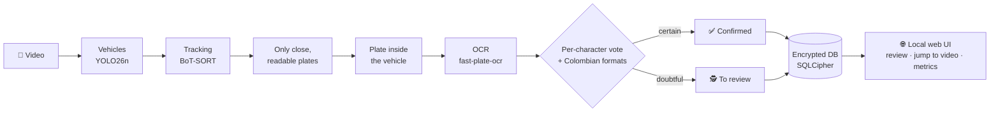
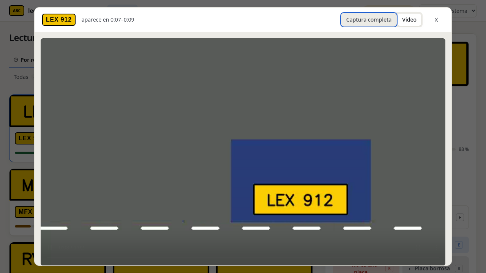

<h1 align="center">lectorPlacas</h1>

<p align="center"><b>Reads Colombian license plates from your videos, on your machine, offline.</b><br>
It detects, tracks and reads every vehicle; anything uncertain is left for you to review, with a button that jumps to
the exact second of the video where the plate appears.</p>

<p align="center">


</p>

<p align="center"><a href="README.md">Español</a> · <a href="docs/guia.md">Full guide (Spanish)</a> ·
<a href="#try-it-in-2-minutes">Try it</a></p>

<p align="center"></p>
<p align="center"><sub>Demo mode: every plate is made up. The interface is in Spanish.</sub></p>

## What it does

- 🎥 **Processes your videos** from fixed cameras (parking lots, streets) or vehicle-mounted cameras (patrol cars).
- 🔎 **Reads each plate many times and votes** on the result against the Colombian plate formats.
- ✅ **Confirms only what is certain.** Anything doubtful is marked *to review*, with the reason ("readings disagree",
  "uncommon format"…), and is reviewed with a single key.
- ⏱️ **Takes you to the exact moment.** From any reading, open the original video one second before the plate appears,
  or see the full frame.
- 🔒 **Everything stays on your machine**: no network while processing, encrypted database and plate crops.

## How it works



Each vehicle is tracked across frames and its plate is read many times. Readings are voted character by character, and
typical confusions (0↔O, 8↔B) are fixed according to the position in the Colombian format. If something does not add
up, it does not guess: a person decides. Everything runs on ONNX models verified by SHA-256.

## The interface

| Review with the keyboard | Jump to the exact second of the video |
|---|---|
|  |  |
| **Process a video** | **Quality metrics** |
|  |  |

Keys: `C` correct · `E` edit · `R` not a plate · `B` blurry · `S` skip · `V` jump to video · `F` full frame.

## Try it in 2 minutes

No videos of your own, made-up data:

```bash
git clone https://github.com/sergiopon/lectorPlacas.git && cd lectorPlacas
uv sync --locked
(cd frontend && npm ci && npm run build)
uv run lector-web --demo          # opens the browser; the temporary folder is deleted on exit
```

With your videos (Linux, [uv](https://docs.astral.sh/uv/), Node.js ≥ 22.12 only to build the UI; NVIDIA GPU optional):

```bash
uv run lector key init            # master key in the system keyring
uv run lector models fetch        # 6 models (~33 MB), verified by SHA-256
mkdir -p videos                   # copy your videos here
uv run lector-web
```

Or with Docker, nothing else to install: [how to use the Docker image](docs/docker.md) (in Spanish).
There is also a CLI (`lector process`, `lector review`, `lector export`…): [guide](docs/guia.md#5-uso-desde-la-terminal-cli).

## Privacy by design

- **No network at runtime**: blocked inside the process itself; only downloading models and datasets uses the internet.
- **Encrypted at rest**: SQLCipher database and AES-GCM crops, with the key in the system keyring.
- **Local-only web UI**: listens on `127.0.0.1`, one-time link and session cookie, no CDN, no analytics.
- **No plates in clear text** in logs or messages; the database stores no video names or paths.
- **Retention**: expired data is purged automatically.

Full rules (Spanish): [`reglas-seguridad.md`](reglas-seguridad.md).

## Honest results

Figures measured in this project, with their sample size. None is rounded in its favour.

**OCR** (`fpo-cct-xs-v2-colombia`, CER = character error rate):

| Where | CER | Plates read fully correct | n |
|---|---|---|---|
| Frozen test set (Roboflow crops) | 3.7 % (95 % CI up to 6.7 %) | 92.1 % | 215 |
| Real video, reviewed by hand (street, 720p) | 12–14 % | ~70 % | 63–170 |

The project target (M-04) was CER ≤ 3 %, so the model is registered as **provisional**. Two retrainings with reviewed
real crops (92 and 329 crops) tied with it, with no demonstrable improvement, and were not adopted.

**Full system** on a 17-minute street video (720p, 872 sightings reviewed by hand):
- **45 %** of the plates were **unreadable even for a person** (blurry or small) and 30 % of the detections were not
  plates. Only 25 % were readable: the ceiling is set by the image, not by the model.
- The system **confirmed only 5.5 %** of the sightings; the rest went to review. This is deliberate (precision first),
  but it shows that today it is a **review assistant**, not an autonomous reader.
- Of the audited automatic confirmations, **93 %** were correct (57 of 61). Target M-01 is 98 %. Two of the errors came
  from an 8→B correction forced by the vehicle type, which spec 050 already fixes.
- **Speed:** 0.85× real time on an RTX 5050 with the 30 fps profile (17 min of video in 20 min); the target is ≥ 1×.

**Own plate detector** (`yolo26n-plates`): F1 0.94 vs 0.88 for the default model, measured on the validation split of
the same dataset it was trained on (biased in its favour). That is why it is not the default.

**Not measured yet:** precision and recall of the full system against a manual video annotation (M-01, M-02, M-03 in
`docs/04-evaluacion.md`). `data/eval/` is empty. The figures above come from human review, not from ground truth.

**Known limitations:**
- Colombian plates only; formats in `config/lector.yaml`.
- Tested only on Linux (Fedora 44) with one GPU. It works without a GPU, but speed was not measured.
- Without a system keyring, a key file is required (`LECTOR_KEY_FILE`, as in Docker).
- The vehicle detector sometimes confuses cars with motorcycles, which causes format doubts.
- No sample video in the repository, for privacy reasons.

## How it was built

Built with **AI-assisted spec-driven development**, between September and October 2026:

- **Design and review: Claude (Anthropic).** Wrote the requirements, the architecture, the 17 ADRs and the specs
  (**78 implemented** out of `specs/000`–`078`; 065 was dropped), and reviewed every
  implementation against its spec, `ARQUITECTURA.md` and the security checklist in `reglas-seguridad.md`.
- **Implementation: coding agents.** Each spec was implemented by an agent on its own branch and worktree: Claude
  Sonnet and Haiku subagents and DeepSeek models, depending on each spec's difficulty. Agents could not modify specs or
  governing documents.
- **Direction, data and validation: the author.** Decided the scope, processed real videos and reviewed more than 1,100
  sightings by hand, trained and evaluated the models with the tools in `training/`, and accepted or rejected every
  result.
- **Per-spec cycle:** spec → implementation on a `feature/NNN-*` branch → gates (ruff, mypy strict, pytest, hidden
  review tests in `tests/review/`) → review → `--no-ff` merge. Status and correction log: `specs/README.md`. When a
  spec was wrong, the spec was fixed, not the code by hand.
- **Working rule:** never invent technical data (versions, plate formats, hashes). Anything that could not be verified
  is marked `NO VERIFICADO` in the repository.

Size (2026-10-04): 14,797 lines of Python in `src/`, 12,099 of tests (751 tests), 5,123 in `training/` and 1,944 of
TypeScript in `frontend/` (UI and its tests: 14 Vitest and 5 Playwright).

---

**Documentation (Spanish):** [user and developer guide](docs/guia.md) · [architecture](ARQUITECTURA.md) ·
[decisions (ADR)](docs/adr/) · [specs](specs/README.md).
License AGPL-3.0 ([`LICENSE`](LICENSE)). Data and model attributions: [`docs/datasets/ATRIBUCIONES.md`](docs/datasets/ATRIBUCIONES.md).
