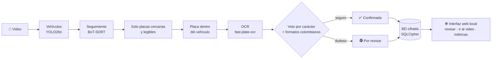

<h1 align="center">lectorPlacas</h1>

<p align="center"><b>Lee las placas colombianas de tus videos, en tu equipo y sin internet.</b><br>
Detecta, sigue y lee cada vehículo; lo dudoso te lo deja para revisar, con un botón que te lleva al segundo exacto del
video en que aparece la placa.</p>

<p align="center">


</p>

<p align="center"><a href="README.en.md">English</a> · <a href="docs/guia.md">Guía completa</a> ·
<a href="#pruébalo-en-2-minutos">Pruébalo</a></p>

<p align="center"></p>
<p align="center"><sub>Modo demo: todas las placas son inventadas.</sub></p>

## Qué hace

- 🎥 **Procesa tus videos** de cámara fija (parqueadero, calle) o de cámara en un vehículo (patrulla).
- 🔎 **Lee cada placa varias veces y vota** el resultado contra los formatos de placa colombianos.
- ✅ **Confirma solo lo seguro.** Lo dudoso queda *por revisar*, con el motivo ("las lecturas no coinciden", "formato
  poco común"…), y se revisa con una tecla.
- ⏱️ **Te lleva al momento exacto.** Desde cada lectura abres el video original un segundo antes de que aparezca la
  placa, o ves el fotograma completo.
- 🔒 **Todo queda en tu equipo**: sin red mientras procesa y con la base de datos y los recortes cifrados.

## Cómo funciona



Cada vehículo se sigue entre fotogramas y su placa se lee muchas veces. Las lecturas se votan carácter a carácter y se
corrigen las confusiones típicas (0↔O, 8↔B) según la posición en el formato colombiano. Si algo no cuadra, no se adivina:
queda para una persona. Todo corre con modelos ONNX verificados por SHA-256.

## La interfaz

| Revisar con el teclado | Ir al segundo exacto del video |
|---|---|
|  |  |
| **Procesar un video** | **Métricas de calidad** |
|  |  |

Teclas: `C` correcta · `E` corregir · `R` no es placa · `B` borrosa · `S` saltar · `V` ir al video · `F` fotograma completo.

## Pruébalo en 2 minutos

Sin videos propios, con datos inventados:

```bash
git clone https://github.com/sergiopon/lectorPlacas.git && cd lectorPlacas
uv sync --locked
(cd frontend && npm ci && npm run build)
uv run lector-web --demo          # abre el navegador; la carpeta temporal se borra al salir
```

Con tus videos (Linux, [uv](https://docs.astral.sh/uv/), Node.js ≥ 22.12 solo para compilar la interfaz; GPU NVIDIA
opcional):

```bash
uv run lector key init            # clave maestra en el llavero del sistema
uv run lector models fetch        # 6 modelos (~33 MB), verificados por SHA-256
mkdir -p videos                   # copia aquí tus videos
uv run lector-web
```

O con Docker, sin instalar nada más: [cómo usar la imagen de Docker](docs/docker.md).
La CLI (`lector process`, `lector review`, `lector export`…) también está: [guía](docs/guia.md#5-uso-desde-la-terminal-cli).

## Privacidad por diseño

- **Sin red en ejecución**: un bloqueo en el propio proceso lo impide; solo la descarga de modelos y datasets usa internet.
- **Cifrado en reposo**: base de datos SQLCipher y recortes AES-GCM, con la clave en el llavero del sistema.
- **Web solo local**: escucha en `127.0.0.1`, enlace de un solo uso y cookie de sesión, sin CDN ni analítica.
- **Sin placas en claro** en logs ni mensajes; la base no guarda nombres ni rutas de los videos.
- **Retención**: los datos vencidos se purgan solos.

Reglas completas: [`reglas-seguridad.md`](reglas-seguridad.md).

## Resultados honestos

Cifras medidas en este proyecto, con su tamaño de muestra. Ninguna está redondeada a favor.

**OCR** (`fpo-cct-xs-v2-colombia`, CER = errores por carácter):

| Dónde | CER | Placas leídas completas | n |
|---|---|---|---|
| Test congelado (recortes de Roboflow) | 3,7 % (IC 95 % hasta 6,7 %) | 92,1 % | 215 |
| Video real revisado a mano (calle, 720p) | 12–14 % | ~70 % | 63–170 |

La meta del proyecto (M-04) era CER ≤ 3 %, así que el modelo está registrado como **provisional**. Dos reentrenamientos
con recortes reales revisados (92 y 329 recortes) empataron con él, sin mejora demostrable, y no se adoptaron.

**Sistema completo** en un video de calle de 17 min (720p, 872 avistamientos revisados a mano):
- El **45 %** de las placas eran **ilegibles incluso para una persona** (borrosas o pequeñas) y el 30 % de las
  detecciones no eran placas. Solo el 25 % era legible: el techo lo pone la imagen, no el modelo.
- El sistema **confirmó solo el 5,5 %** de los avistamientos; el resto quedó para revisión. Es deliberado (precisión
  primero), pero muestra que hoy es un **asistente de revisión**, no un lector autónomo.
- De las confirmaciones automáticas auditadas, el **93 %** eran correctas (57 de 61). La meta M-01 es 98 %. Dos de los
  errores se debían a una corrección 8→B forzada por el tipo de vehículo, que la spec 050 ya corrige.
- **Velocidad:** 0,85× tiempo real en una RTX 5050 con el perfil de 30 fps (17 min de video en 20 min); la meta es ≥ 1×.

**Detector de placas propio** (`yolo26n-plates`): F1 0,94 frente a 0,88 del modelo por defecto, medido sobre la
validación del mismo dataset con que se entrenó (sesgado a su favor). Por eso no es el predeterminado.

**No medido todavía:** precisión y recall del sistema completo contra una anotación manual de video (M-01, M-02, M-03
de `docs/04-evaluacion.md`). `data/eval/` está vacío. Las cifras de arriba vienen de la revisión humana, no de ground
truth.

**Limitaciones conocidas:**
- Solo placas colombianas; formatos en `config/lector.yaml`.
- Probado solo en Linux (Fedora 44) con una GPU. Sin GPU funciona, pero no se midió la velocidad.
- Sin llavero del sistema hace falta un archivo de clave (`LECTOR_KEY_FILE`, como en Docker).
- El detector de vehículos a veces confunde carros con motos, y eso genera dudas de formato.
- Sin video de ejemplo en el repositorio, por privacidad.

Plan de mejora y diagnóstico completo: [`docs/historial/07-plan-mejora-lectura.md`](docs/historial/07-plan-mejora-lectura.md).

## Cómo se construyó

El proyecto se hizo con **spec-driven development asistido por IA**, entre septiembre y octubre de 2026:

- **Diseño y revisión: Claude (Anthropic).** Escribió los requisitos, la arquitectura, los 17 ADRs y las specs
  (**78 implementadas** de `specs/000`–`078`; la 065 se descartó), y revisó cada implementación contra su spec, `ARQUITECTURA.md` y el checklist de seguridad de
  `reglas-seguridad.md`.
- **Implementación: agentes de código.** Cada spec la implementó un agente en su propia rama y worktree: subagentes
  Claude Sonnet y Haiku y modelos DeepSeek, según la dificultad de cada spec. Los agentes no podían modificar
  specs ni documentos rectores.
- **Dirección, datos y validación: el autor.** Decidió el alcance, procesó videos reales y revisó a mano más de 1 100
  avistamientos, entrenó y evaluó los modelos con las herramientas de `training/` y aceptó o rechazó cada resultado.
- **Ciclo por spec:** spec → implementación en rama `feature/NNN-*` → compuertas (ruff, mypy strict, pytest,
  tests de revisión ocultos en `tests/review/`) → revisión → merge `--no-ff`. Estado de cada spec y registro de
  correcciones: `specs/README.md`. Cuando una spec estaba mal, se corregía la spec, no el código a mano.
- **Regla de trabajo:** no inventar datos técnicos (versiones, formatos de placa, hashes). Lo que no se pudo
  verificar está marcado `NO VERIFICADO` en el repositorio.

Tamaño (2026-10-04): 14 797 líneas de Python en `src/`, 12 099 de tests (751 tests), 5 123 en `training/` y
1 944 de TypeScript en `frontend/` (interfaz y sus pruebas: 14 de Vitest y 5 de Playwright).
Las instrucciones operativas de los agentes (`CLAUDE.md`, `CONTEXT.md` y el plan de orquestación) son archivos locales
que no se publican. Por eso algunos documentos los mencionan sin que estén en el repositorio. Las specs, ADRs, contratos
y tests sí están completos.

---

**Documentación:** [guía de uso y desarrollo](docs/guia.md) · [arquitectura](ARQUITECTURA.md) · [decisiones (ADR)](docs/adr/) ·
[specs](specs/README.md).
Licencia AGPL-3.0 ([`LICENSE`](LICENSE)). Atribuciones de datos y modelos: [`docs/datasets/ATRIBUCIONES.md`](docs/datasets/ATRIBUCIONES.md).
