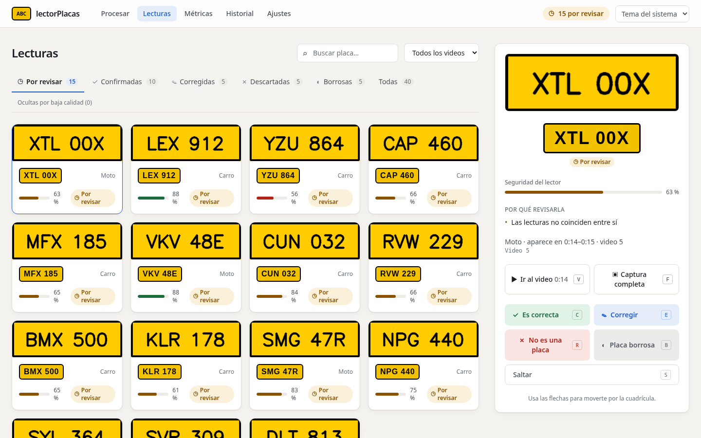
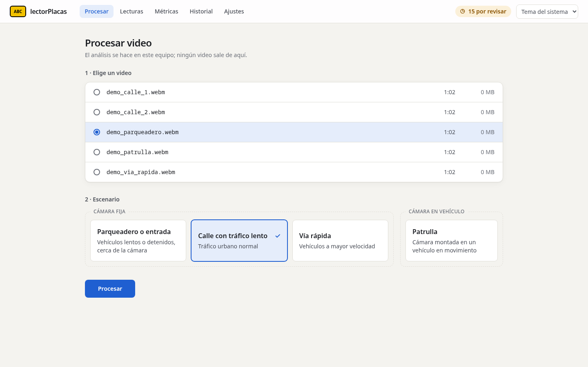
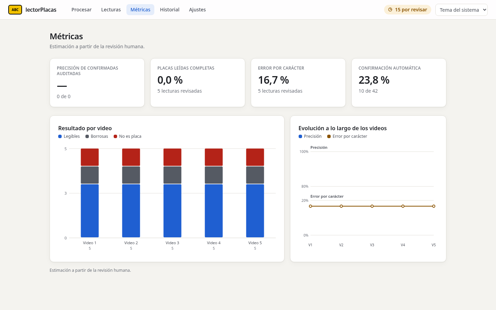

# Guía de uso y desarrollo de lectorPlacas

Manual completo. La presentación del proyecto está en el [README](../README.md).

## Índice
2. [Requisitos](#2-requisitos)
3. [Instalación y primer uso](#3-instalación-y-primer-uso) · [3b. Con Docker](#3b-con-docker-sin-instalar-uv-python-ni-node)
4. [Uso diario con la interfaz web](#4-uso-diario-con-la-interfaz-web)
5. [Uso desde la terminal (CLI)](#5-uso-desde-la-terminal-cli)
6. [Cómo decide el sistema](#6-cómo-decide-el-sistema)
7. [Configuración](#7-configuración)
8. [Dónde queda cada cosa](#8-dónde-queda-cada-cosa)
9. [Medir la calidad](#9-medir-la-calidad)
10. [Entrenar los modelos](#10-entrenar-los-modelos)
11. [Seguridad y privacidad](#11-seguridad-y-privacidad)
12. [Desarrollo](#12-desarrollo)
13. [Problemas frecuentes](#13-problemas-frecuentes)

---

## 2. Requisitos

- **Linux** (probado en Fedora 44).
- **GPU NVIDIA** opcional (probado con una RTX 5050). No hace falta instalar CUDA: las bibliotecas vienen en los paquetes
  `nvidia-*` que instala `uv sync`; basta el driver de NVIDIA.
- **Sin GPU también funciona**, en CPU y bastante más lento. ONNX Runtime imprime un bloque `EP Error ... no
  CUDA-capable device is detected ... Falling back to ['CPUExecutionProvider']` por cada modelo: es un aviso, no un
  fallo. Para quitarlo, pon `inference.execution_provider: cpu` en `config/lector.yaml`.
- **[uv](https://docs.astral.sh/uv/)** en `~/.local/bin/uv`. uv instala Python 3.13 y todas las dependencias; no
  hace falta instalar Python a mano.
- Un **llavero del sistema** (GNOME Keyring o KWallet) para guardar la clave maestra (o un archivo de clave, §3b).
- **Node.js 22.12 o posterior** y npm, solo para compilar la interfaz web (`frontend/`). No se usa en ejecución.
- Opcional: `strace`, para los chequeos no funcionales (`scripts/nivel_f.py`).

> ⚠️ **Hay otro programa llamado `lector`** (un lector de ebooks en `/usr/bin/lector`). Ejecuta siempre este
> proyecto con `uv run lector ...` desde la carpeta del repo, o activa el entorno (`source .venv/bin/activate`).

---

## 3. Instalación y primer uso

```bash
cd lectorPlacas
export PATH=~/.local/bin:$PATH        # si uv está en ~/.local/bin; conviene añadirlo a ~/.bashrc

uv sync --locked                      # crea .venv con Python 3.13 y todo lo necesario
uv run python scripts/verify_gpu.py   # opcional: comprueba que ONNX Runtime ve la GPU

uv run lector key init                # crea la clave maestra en el llavero (una sola vez; no pisa una existente)
uv run lector models fetch            # descarga los modelos (única orden con red, además de los datasets)
uv run lector models verify           # comprueba el hash SHA-256 de todos los modelos
```

`models fetch` descarga tres modelos de sus autores (open-image-models y fast-plate-ocr) y tres de este proyecto,
publicados en el Release [`models-v1`](https://github.com/sergiopon/lectorPlacas/releases/tag/models-v1):
`yolo26n-coco` (exportado a ONNX), `yolo26n-plates` y `fpo-cct-xs-v2-colombia` (entrenados con `training/`). Si un
archivo no coincide con el hash de `config/models.yaml`, no se carga.

Crea la carpeta **`videos/`** (`mkdir -p videos`) y pon ahí tus videos. Por seguridad solo se aceptan videos dentro de esa carpeta, con extensión `.mp4`,
`.mov`, `.mkv`, `.avi`, `.m4v` o `.webm` y hasta 4 GB.

---

## 3b. Con Docker (sin instalar uv, Python ni Node)

Pensado para funcionar igual en Linux (Docker o Podman, con o sin root) y en Windows (Docker Desktop, desde PowerShell).
Probado de punta a punta con Docker en Fedora 44 (CPU); Windows, Podman y Docker sin root están **NO VERIFICADOS**. Los
comandos son los mismos en bash y en PowerShell:

```bash
docker compose build                                          # imagen de ~10 GB; descarga los modelos al construir
docker compose run --rm lector lector key init-file /app/keys/lector_key   # clave maestra, una sola vez
docker compose up                                             # CPU
```

Abre la dirección `Abra: http://127.0.0.1:8765/auth?token=…` que aparece en la salida. El puerto se publica solo en
`127.0.0.1` del equipo.

- **Videos:** pon los videos en la carpeta `videos/` del proyecto, que se monta en solo lectura. Para usar otra carpeta,
  define `LECTOR_VIDEOS_DIR` antes de `up` (bash: `export LECTOR_VIDEOS_DIR=/ruta`; PowerShell:
  `$env:LECTOR_VIDEOS_DIR="D:\videos"`). En Linux los archivos deben ser legibles por otros usuarios (modo 644).
- **Datos, registros y clave:** viven en los volúmenes de Docker `lector-data`, `lector-logs` y `lector-keys`, no en
  carpetas del proyecto. Así no dependen de los permisos del sistema de archivos del anfitrión (NTFS no los tiene).
  `docker compose down` los conserva; `docker compose down -v` **los borra**, junto con la base de datos.
- **Procesar desde la línea de comandos:** `docker compose run --rm lector lector process videos/<archivo>`.
- **Sacar exportaciones:** `docker compose cp lector:/app/data/exports ./exports` (con el servicio en marcha).
- **GPU NVIDIA** (`docker compose --profile gpu up lector-gpu`): en Linux necesita el NVIDIA Container Toolkit; en
  Windows, Docker Desktop con WSL2 y el controlador NVIDIA de Windows. En Podman se usa CDI en lugar de
  `deploy.resources`. **NO VERIFICADO**: solo se ha probado la CPU (en Fedora 44).
- **Podman o SELinux:** si al leer los videos aparece `Permission denied`, añade `,z` al montaje de videos en
  `compose.yaml` (`…:/app/videos:ro,z`).
- **Windows: NO VERIFICADO** en un equipo con Windows; el diseño evita lo que allí falla (UID del anfitrión, permisos de
  archivos y finales de línea CRLF, que `.gitattributes` impide).

---

## 4. Uso diario con la interfaz web

```bash
uv run lector-web                # abre el navegador; --no-browser solo imprime la dirección
```

`lector-web` escucha solo en `127.0.0.1` (nadie más en la red puede entrar), en un puerto libre, y abre el navegador
con un enlace de un solo uso que inicia la sesión. Si cierras la pestaña, reinicia `lector-web` para obtener otro.



**Procesar**: elige un video de `videos/` y el escenario (*Parqueadero o entrada*, *Calle con tráfico lento*, *Vía
rápida* o *Patrulla*, ver §7) y pulsa *Procesar*. Se ve el avance en vivo y se puede cancelar. Al terminar, *Revisar N
placas* lleva directo a sus lecturas.

**Lecturas**: una tarjeta por placa (recorte + texto), con pestañas *Por revisar*, *Confirmadas*, *Corregidas*,
*Descartadas*, *Borrosas* y *Todas*, búsqueda por placa y filtro por video. Las que el filtro de legibilidad considera
inservibles van aparte, en *Ocultas por baja calidad*. El panel derecho muestra la placa en grande, lo que leyó el
sistema, su seguridad y **por qué hay que revisarla**:

| Tecla | Acción |
|---|---|
| `C` | Es correcta |
| `E` | Corregir el texto (`Enter` guarda, `Esc` cancela) |
| `R` | No es una placa |
| `B` | Placa borrosa: es una placa, pero no se lee |
| `S` | Saltar |
| `V` | **Ir al video**: abre el video original un segundo antes de que aparezca la placa |
| `F` | Captura completa: el fotograma entero de ese momento |

Tras decidir, pasa sola a la siguiente pendiente. El video se encuentra por su huella SHA-256 dentro de `videos/` (la
base no guarda nombres ni rutas); si lo borraste o lo moviste fuera de `videos/`, la interfaz lo indica.

**Métricas**: precisión de las confirmadas auditadas, lecturas completas, error por carácter y tasa de confirmación
automática, con gráficos por video. **Historial**: los videos procesados. **Ajustes**: retención, exportar CSV (a
`data/exports/`) y purgar datos vencidos.

| | |
|---|---|
|  |  |

Las capturas son del modo demo (`lector-web --demo`): placas inventadas, ningún dato real.

---

## 5. Uso desde la terminal (CLI)

Casi todo lo que hace la interfaz web se puede hacer por terminal. Siempre con `uv run lector ...`.

| Orden | Para qué |
|---|---|
| `lector key init` | Crear la clave maestra en el llavero (primera vez) |
| `lector key init-file <ruta>` / `key export-file <ruta>` | Crear la clave en un archivo 0400, o copiar ahí la del llavero (para Docker; se usa con `LECTOR_KEY_FILE`) |
| `lector models fetch` / `verify` | Descargar / verificar modelos |
| `lector process videos/<v>.mp4 [--profile calle_lenta]` | Procesar un video |
| `lector review [--limit N] [--status unverified\|confirmed]` | Revisar en una ventana OpenCV. Teclas: `C` confirmar, `E` editar, `R` rechazar, `B` borrosa, `S` saltar, `Q` salir. Con `--status confirmed` se **auditan** las confirmadas automáticas |
| `lector export [--status ...]` | Exportar avistamientos a CSV (`data/exports/`) |
| `lector purge` | Borrar lo que venció según la retención (también corre sola al iniciar cada orden) |
| `lector evaluate --video <v> --ground-truth <gt.json> [--profile p]` | Medir precisión y recall contra una anotación manual (§9) |
| `lector evaluate-review` | Métricas a partir de tus revisiones: precisión de confirmadas, CER real, etc. |
| `lector evaluate-ocr --crops <csv>` | CER del OCR sobre recortes anotados |
| `lector evaluate-detector [--dataset d] [--split val]` | Precisión/recall del detector de placas |
| `lector dataset download` / `prepare` | Descargar y preparar datasets de Roboflow (requiere `ROBOFLOW_API_KEY`) |
| `lector dataset merge-detection` / `chars-to-ocr` | Pasos intermedios de `prepare` |
| `lector dataset export-reviewed` | Exportar tus recortes revisados para reentrenar el OCR |

Opción global: `lector --config config/<otro>.yaml ...`. La config alternativa **debe estar dentro de `config/`**.

---

## 6. Cómo decide el sistema

Por cada vehículo se guardan hasta `max_readings_per_track` lecturas (8 en *calle lenta*): **las de mejor calidad**,
es decir, la placa más ancha en pantalla y, con el mismo ancho, la más nítida. Al salir el vehículo de cámara se
consolidan (algoritmo en `docs/adr/ADR-007-votacion.md`):

1. Se vota carácter por carácter, ponderando por la confianza del OCR.
2. Se prueban los formatos colombianos del catálogo (`config/lector.yaml`), p. ej. `ABC123` (carro), `ABC12D` (moto
   nueva), `ABC12` (moto antigua) y `123ABC` (motocarro). Se corrigen confusiones típicas (0↔O, 1↔I, 8↔B, 5↔S).
3. Si esa corrección cambiaría una lectura que ya era una placa válida por otra, gana la lectura original y queda
   **por revisar** ("Podría ser otra placa").
4. Se confirma solo si no hay ningún motivo de duda.

Motivos de "por revisar":

| Motivo (en la interfaz) | Código |
|---|---|
| Se leyó pocas veces | `insufficient_readings` |
| El lector no estaba seguro | `low_confidence` |
| Las lecturas no coinciden entre sí | `low_agreement` |
| No parece una placa colombiana | `unrecognized_format` |
| Formato de placa poco común | `unverified_format` |
| El formato no corresponde al tipo de vehículo | `vehicle_format_mismatch` |
| Encaja en más de un formato | `ambiguous_format` |
| Podría ser otra placa: una letra o un número dudoso | `correction_conflict` |
| Parece borrosa (filtro automático; desactivado hasta aceptar un modelo) | `predicted_illegible` |
| Parece que no es una placa (filtro automático; desactivado hasta aceptar un modelo) | `predicted_not_plate` |

En la base de datos, `ocr_text` es lo que leyó el sistema (no cambia nunca) y `plate_text` es el texto vigente (la
revisión lo sobrescribe).

---

## 7. Configuración

Archivo principal: **`config/lector.yaml`** (esquema en `docs/03-modelo-datos.md`).

- `models`: qué detector de vehículos, detector de placas y OCR se usan. El OCR en uso es `fpo-cct-xs-v2-colombia`.
  Para probar el detector de placas propio:
  `plate_detector: {backend: yolo, model_id: yolo26n-plates, input_size: 640}`.
- `profiles`: un perfil por escenario:

| Parámetro | parqueadero | calle_lenta | calle_rapida |
|---|---|---|---|
| `target_fps` (frames analizados por segundo) | 10 | 15 | 30 |
| `max_readings_per_track` (lecturas que se votan) | 8 | 8 | 6 |
| `track_finalize_after_ms` (cuándo se da por ido un vehículo) | 3000 | 2000 | 1000 |
| `min_readings` / `confirm_threshold` / `min_agreement` | 3 / 0.90 / 0.60 | 3 / 0.90 / 0.60 | 2 / 0.90 / 0.60 |
| `min_plate_width_px` (ancho mínimo para intentar leer) | 20 | 20 | 20 |
| `min_sharpness` (0 = sin filtro) | 0.0 | 0.0 | 0.0 |

  Estos valores son **provisionales**: se calibran en la Fase 2 de `docs/historial/07-plan-mejora-lectura.md`.
- `plate_formats`: catálogo de formatos con su fuente normativa. Los que tienen `verified: false` nunca se confirman
  solos.
- `retention`: recortes 90 días (temporalmente; el valor normal es 30, ver `docs/historial/08-plan-legibilidad-y-web.md` §2.2), registros 90 días y exportaciones de entrenamiento 180 días.

**`config/models.yaml`** es el manifiesto de modelos: archivo, URL y hash SHA-256. Si un `.onnx` no coincide con su
hash, no se carga.

---

## 8. Dónde queda cada cosa

```
config/            lector.yaml (configuración), models.yaml (manifiesto de modelos), datasets.yaml (Roboflow)
videos/            tus videos de entrada (única carpeta permitida)
data/lector.db     base de datos cifrada (SQLCipher)             ← haz copia antes de actualizar versiones
data/crops/        recortes de placa cifrados (AES-GCM)
data/exports/      CSV exportados
data/eval/         anotaciones (ground_truth/) y reportes de evaluación (reports/)
logs/lector.log    registro, sin textos de placa en claro
models/            modelos ONNX verificados por hash
training/detector  entrenamiento del detector de placas (proyecto uv aparte)
training/ocr       entrenamiento del OCR colombiano (proyecto uv aparte)
training/legibility entrenamiento del filtro de legibilidad (proyecto uv aparte; `legibility.enabled: false` por defecto)
src/lector_placas  código (ver §12)
docs/              requisitos, contratos, modelo de datos, evaluación, ADRs y planes ya ejecutados (docs/historial/)
frontend/          interfaz web (React + Vite); `npm run build` genera frontend/dist, que sirve lector-web
specs/             especificaciones numeradas (000–078) y su estado en specs/README.md
```

La clave maestra **no** está en disco: vive en el llavero del sistema. Sin ella no se pueden leer ni la base ni los
recortes.

---

## 9. Medir la calidad

Criterios completos en `docs/04-evaluacion.md`. Métricas principales:

| Métrica | Qué mide | Meta |
|---|---|---|
| M-01 | Precisión de las confirmadas | ≥ 98 % |
| M-02 | Recall total (placas legibles encontradas) | ≥ 90 % |
| M-03 | Recall de confirmadas | ≥ 75 % |
| M-04 | CER del OCR (errores por carácter) | ≤ 3 % |
| M-05 | Velocidad (duración del video / tiempo de proceso) | ≥ 1,0 |

**Sin anotar nada** (a partir de tus revisiones):
```bash
uv run lector review --status confirmed   # audita confirmadas automáticas
uv run lector evaluate-review              # precisión estimada, CER real, desglose de motivos
```

**Con anotación manual** (lo más fiable): crea `data/eval/ground_truth/<sha256 del video>.json` siguiendo el formato
de `docs/04-evaluacion.md` §2 (placas, tipo de vehículo, tiempos) y ejecuta:
```bash
uv run lector evaluate --video videos/<v>.mp4 --ground-truth data/eval/ground_truth/<sha>.json --profile calle_lenta
```
Nota: `evaluate` procesa el video de verdad, así que sus avistamientos aparecen también en la galería.

---

## 10. Entrenar los modelos

Cada carpeta de `training/` es un proyecto uv independiente, con su propio lock y torch/CUDA. Se ejecuta **desde su
carpeta**. Los datos (`datasets/`) y los resultados (`runs/`) no se versionan.

**Datasets de Roboflow** (desde la raíz):
```bash
export ROBOFLOW_API_KEY=...
uv run lector dataset prepare     # descarga, fusiona para el detector y genera recortes para el OCR
```

**Detector de placas** (desde `training/detector`):
```bash
uv run python -m detector_training.fetch_base_weights
uv run python -m detector_training.train_plates --data merged/data.yaml --name <run>
```
Publica en `models/yolo26n-plates/` e imprime el hash, que se copia a `config/models.yaml`.

**OCR colombiano** (desde `training/ocr`), receta de ADR-014:
```bash
uv run python -m ocr_training.fetch_assets
uv run python -m ocr_training.synthetic_plates --output syn_v1 --count 1500 --val-fraction 0 --seed 1
uv run python -m ocr_training.mix_dataset --real ocr_colombia --synthetic syn_v1 --output mix_v1 --seed 0
uv run python -m ocr_training.train --train mix_v1/train/annotations.csv --val mix_v1/val/annotations.csv \
    --epochs 150 --batch-size 64 --patience 40 --seed 0 --name colombia_v1
uv run python -m ocr_training.evaluate_ocr --crops mix_v1/test/annotations.csv --candidate runs/colombia_v1/<fecha>/best.onnx
```
- El `test` de `mix_v1` está **congelado**: nunca entrena y sirve para comparar todas las versiones.
- `train.py` **sobrescribe** `models/fpo-cct-xs-v2-colombia/` aunque el modelo salga peor. Guarda antes una copia del
  `.onnx` en uso.

**Reentrenar con tus revisiones** (spec 054):
```bash
uv run lector dataset export-reviewed                        # desde la raíz → training/ocr/datasets/own/reviewed-<fecha>
cd training/ocr
uv run python -m ocr_training.mix_dataset --frozen-from mix_v1 --real own/reviewed-<fecha> \
    --synthetic syn_v1 --output mix_v2 --seed 0
uv run python -m ocr_training.train --train mix_v2/train/annotations.csv --val mix_v2/val/annotations.csv \
    --epochs 150 --batch-size 64 --patience 40 --seed 0 --name colombia_v2
uv run python -m ocr_training.evaluate_ocr --crops mix_v2/test/annotations.csv --candidate runs/colombia_v2/<fecha>/best.onnx
uv run python -m ocr_training.evaluate_ocr --crops mix_v2/test_video/annotations.csv \
    --candidate runs/colombia_v2/<fecha>/best.onnx --baseline runs/colombia_v1/<fecha>/best.onnx
```
Con menos de 100 recortes en `test_video`, la decisión dirá RECHAZAR por muestra insuficiente. Es lo esperado: allí
se compara el CER de v2 con el de v1.

---

## 11. Seguridad y privacidad

Reglas completas en `reglas-seguridad.md` (SEG-01..SEG-29). Lo esencial:
- **Sin red en ejecución.** Todas las órdenes bloquean la red, salvo `models fetch`, `dataset download` y
  `dataset prepare`.
- **Cifrado en reposo.** La base va en SQLCipher y los recortes en AES-GCM, con subclaves derivadas de la clave maestra
  del llavero.
- **Sin placas en claro** en logs, reportes, auditoría ni mensajes de error.
- **Web solo local.** `lector-web` escucha en `127.0.0.1`, rechaza cualquier `Host` ajeno, exige una cookie de sesión
  obtenida con un enlace de un solo uso y envía una CSP sin orígenes externos: sin CDN, sin fuentes remotas, sin
  analítica. El video y los fotogramas se sirven solo con sesión y nunca se escriben a disco.
- **Retención.** Los datos vencidos se purgan solos al iniciar cada orden.
- **Modelos verificados** por SHA-256 en cada carga. Solo ONNX, nunca pickles de PyTorch.
- **Entradas acotadas.** Solo videos de `videos/`, con extensión y tamaño permitidos. Las rutas se resuelven dentro
  del proyecto.

---

## 12. Desarrollo

Arquitectura limpia (`ARQUITECTURA.md`). Regla de dependencia verificada por `tests/architecture`:

```
domain  ←  application  ←  infrastructure / adapters  ←  evaluation / datasets  ←  cli  (composition root)
                                                                                  ←  web  (2.º composition root, FastAPI)
```

| Capa | Contenido |
|---|---|
| `domain` | Entidades, catálogo de formatos, corrección posicional, consolidación (solo stdlib) |
| `application` | Casos de uso (`ProcessVideo`, `ReviewSightings`, `DecideSighting`, exportar, purgar) y puertos (Protocols) |
| `adapters` | ONNX (detectores, OCR), BoT-SORT, PyAV, SQLCipher, recortes cifrados, ventana OpenCV |
| `infrastructure` | Configuración, claves, registro de modelos, red controlada |
| `evaluation` / `datasets` | Métricas y herramientas de datasets |
| `cli` / `web` | Puntos de entrada (`lector`, `lector-web`) |
| `frontend/` | Interfaz React + TypeScript (diseño de Figma Make), solo habla con `/api` |

Comandos:
```bash
uv run pytest                                  # toda la suite (marcadores: -m gpu, -m integration)
(cd frontend && npm test && npm run e2e)       # Vitest y Playwright (Chromium) contra lector-web --demo
uv run ruff check . && uv run ruff format --check .
uv run mypy src                                # modo strict
uv run pre-commit run --all-files
uv run python scripts/nivel_f.py               # red (strace), permisos, cifrado, placas en claro, web solo en loopback, velocidad, VRAM
```

Cómo se trabaja: **spec-driven development**. Cada cambio se describe primero en una spec de `specs/` y se implementa en
una rama `feature/NNN-*` con merge `--no-ff`. El estado de cada spec y el registro de correcciones están en
`specs/README.md`. Las firmas exactas están en `docs/02-contratos.md` y las decisiones, en `docs/adr/`.

---

## 13. Problemas frecuentes

| Síntoma | Causa y solución |
|---|---|
| `ModuleNotFoundError: No module named 'imghdr'` al ejecutar `lector` | Se ejecutó el lector de ebooks del sistema. Usa `uv run lector` |
| "manifiesto de modelos inválido" con `--config` | La config alternativa debe estar dentro de `config/` |
| Bloque `EP Error ... no CUDA-capable device ... Falling back to CPUExecutionProvider` | No hay GPU NVIDIA usable. Funciona en CPU; para quitar el aviso, `inference.execution_provider: cpu` |
| `lector models fetch` falla | Revisa la conexión y que el Release `models-v1` exista. Los archivos a medias se borran solos |
| Va muy lento / "cae a CPU" | Revisa `scripts/verify_gpu.py` y que `inference.execution_provider` sea `cuda` |
| Error de clave o del llavero | Ejecuta `lector key init` en una sesión de escritorio con llavero desbloqueado. Sin la clave original, los datos cifrados no se recuperan |
| Un modelo "no verificado" tras entrenar | `train.py` sobrescribió el `.onnx`. Restaura tu copia o registra el hash nuevo en `config/models.yaml` |
| La interfaz dice "Frontend no compilado" | Ejecuta `npm ci && npm run build` en `frontend/` y reinicia `lector-web` |
| "El video original no está disponible" | El video ya no está en `videos/` con el mismo contenido. Vuelve a copiarlo ahí |
| `token inválido` al abrir el enlace | El enlace es de un solo uso. Reinicia `lector-web` |
| "versión de esquema no soportada" | La base es de una versión más nueva que el código. Actualiza el repo; no la borres |

